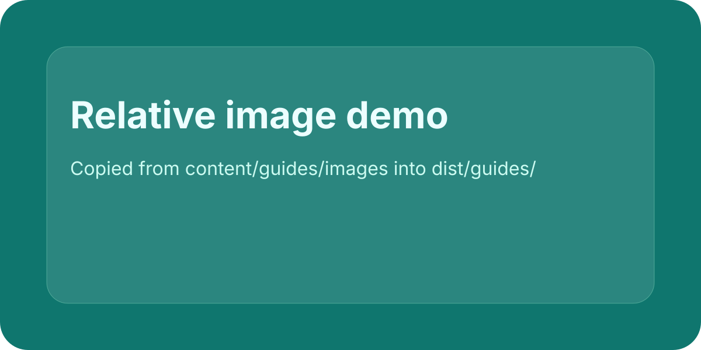

# Install

Use an absolute asset URL when the image lives in the shared assets directory.

The same page can also use a relative image next to the markdown file. The builder will copy it into the page output directory and rewrite the link.

